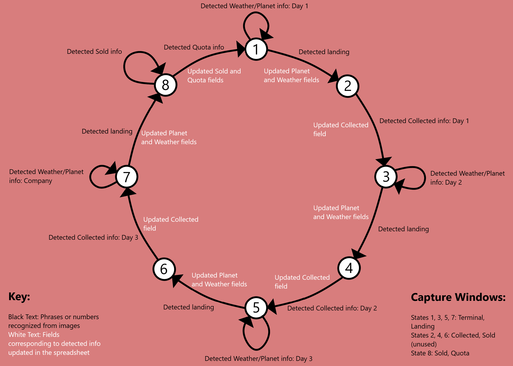

# LethalCompanySpreadsheetUpdater
# --DESCRIPTION--

Uses Tesseract OCR to automatically scan your Lethal Company game screen for information and sends it directly to a Google Sheet for record keeping or to be used in an overlay for streaming/recording software. This software is for Windows OS.

The software works by taking small images of different areas of the screen at a rate of about twice a second, and upon recognizing either digits on certain key phrases, it will update your spreadsheet accordingly. I have my spreadsheet linked to an overlay in OBS, which allows me to not only automatically updated my spreadsheet to keep track of my runs of High Quota%, but also allows the recording/stream of the game to always have important information for reference. 

In order to save time and gather as much information as possible, only two of the five image captures are used at any given time. The script cycles through states based on the information it is receiving, and switches the captures that it analyzes accordingly. For example, the first state has two captures being analyzed, one for the green text on the terminal (for determining Planet and Weather) and one for the blue text that displays the seed (for switching to the next state). Upon reading the blue text that signifies landing on a planet, the script will update the Planet and Weather values in your spreadsheet, and the cycle to state 2, which utilizes a capture for the amount collected at the end of a day. 

This was made with high level runs of the game in mind, things like a team wipe or selling before the final day will disrupt the state cycling system and produce incorrect data. It is important that whoever is running the software views all the information of the game in order to properly update the spreadsheet. To ensure this:

- Make sure the person using the software is the one interacting with the terminal
- Even if you're returning the the same planet, go to the terminal and try to route there (this is to update Weather)
- Neutral backgrounds make scans significantly more accurate, so during sales or at the end of a day, facing a wall can be helpful
- Two images per second is fast, but people can be faster. Make sure you've gotten a good view of anything that comes across the in game terminal, both the Weather and Planet information as well as the confirmation message
- Tying in to the above point, moving around while the lever is being pulled to land on a planet significantly decreases the odds of the text used to move into the next state being recognized, so holding still here can be very helpful in increasing accuracy

# --SETUP--

You need to have the pytesseract, pillow, opencv, gspread, and numpy libraries to use this software.

To properly set up Tesseract, after downloading, find the filepath of tesseract.exe and copy it. Towards the top of lethalSSUpdater.py, there is a place to insert this filepath.

This software uses two sets of training data to perform character recognition, one is the default eng.traineddata that comes with Tesseract, the other is a specific training data for digits in the font used by Lethal Company, called eng3270.traineddata. This was created to increase accuracy of scans for numbers, as there are less characters to misidentify text with, and the font used in the training data matches the font used in game. Make sure to put the eng3270.traineddata file in the tessdata folder of your Tesseract-OCR download folder.

In order to properly set up the Google Sheets, follow this very helpful guide at https://callmefred.com/how-to-connect-python-to-google-sheets/
There is a place to put your creds.json file and the name of your spreadsheet towards the top of lethalSSUpdater.py.

Make sure to scroll to the bottom of lethalSSUpdater.py to adjust which cells you'd like to be updated. My spreadsheet, for example, is linked here:
https://docs.google.com/spreadsheets/d/11De5wmn3VgH-bDDjlPDJxXZHlxHV9jTiyEwoHONQDVo/edit?usp=sharing

Run it in your Command Prompt via `python lethalSSUpdater.py`. Any information that has been updated and a little more is displayed in this terminal.

# --PLANNED UPDATES--

- I plan to implement a way to manually advance the state forward or backwards by one, in case the text that is used to advance to another state is either misread or not recognized at all.

